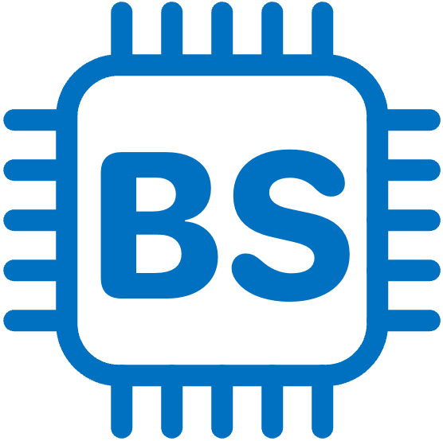

# BlueScript



**BlueScript** is a small and efficient programming language designed specifically for microcontrollers.  
While it currently supports only the ESP32 board, future updates will include support for a wider range of boards.

# Get Started

## Requirements
To start using BlueScript, you'll need the following:
- **ESP32** board
    - Currently, only the **ESP32-WROOM-32** module is supported.
- A computer running **Windows**, **Linux**, or **macOS**.
- A **USB cable** (USB A / micro USB B) to connect your ESP32 to your computer.

## Install and Build

### Clone the Repository
First, clone the BlueScript repository using Git:

```bash
git clone git@github.com:csg-tokyo/bluescript.git
```

### Build and Start the BlueScript Server

1. Set up Docker and Docker Compose:
    - Install Docker: [Docker installation guide](https://docs.docker.com/get-docker/)
    - Install Docker Compose: [Docker Compose installation guide](https://docs.docker.com/compose/install/)

2. Start the BlueScript Local Server
```
cd bluescript
docker compose up -d
```

3. Verify that the server has started successfully
    Open [Google Chrome browser](https://www.google.com/chrome/) and access [http://localhost:3000/](http://localhost:3000/).  
    You can see BlueScript REPL page on the browser.

### Build and Flash the BlueScript Runtime  

1. Build the BlueScript runtime:
```bash
docker run --rm -v $PWD:/project -w /project/microcontroller/ports/esp32 -u $UID -e HOME=/tmp espressif/idf:release-v5.0 idf.py build
```

2. Install [esptool](https://docs.espressif.com/projects/esptool/en/latest/esp32/):
```bash
pip install esptool
```

3. Connect your microcontroller to the computer via USB and check the serial port.  
Common serial port naming patterns:
    * Windows: Ports start with `COM`.
    * MacOS: Ports start with `/dev/tty`.
    * Linux: Ports start with `/dev/cu`.
Once you have identified the correct port, set it to the PORT environment variable:
```bash
PORT=your_serial_port_name
```

4. Flash the BlueScript runtime to the ESP32 device:
```bash
esptool.py --chip esp32 -b 460800 --before=default_reset --after=hard_reset write_flash --flash_mode dio --flash_freq 40m --flash_size 4MB \
0x1000 ./microcontroller/ports/esp32/build/bootloader/bootloader.bin \
0x10000 ./microcontroller/ports/esp32/build/bluescript.bin \
0x8000 ./microcontroller/ports/esp32/build/partition_table/partition-table.bin
```


## Write Your First Program
After setting up BlueScript, follow these steps to write and run a "Hello World" program:

1. Open [Google Chrome browser](https://www.google.com/chrome/) and access [http://localhost:3000/](http://localhost:3000/).  
  BlueScript REPL communicates with the microcontroller via Bluetooth, so the browser should be [Google Chrome browser](https://www.google.com/chrome/) which only supports [Web Bluetooth](https://developer.mozilla.org/ja/docs/Web/API/Web_Bluetooth_API). 

2. Click the Start button.  
  You’ll be prompted to select a Bluetooth device. Choose `BLUESCRIPT`.  

3. Write the following code in the cell:
```typescript
print("Hello world!");
```

4. Click the execution button on the left side of the cell to run your code in the cell.  
  You can see "Hello world!" in the log area on the right side of the page.

