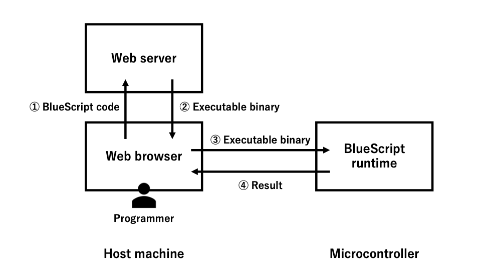

# BlueScript

## Directory structure
- **server:** Node.js server for compiling BlueScript code.
- **notebook:** React app of BlueScript development environment.
- **esp32:** ESP-IDF app for recieving and executing code. 
- **lib:** BlueScript libraries which will be converted to `./esp32/components/lib/hardwarelib.c`.

## Setting Up BlueScript

### Architecture



### Setting up server
**Dependencies:** [Node.js](https://nodejs.org/en), [npm](https://www.npmjs.com)

1. Open the terminal app and move to `./server/`.
2. Run the following command.
   ```bash
   npm run exec
   ```
   
### Setting up notebook
**Dependencies:** [Node.js](https://nodejs.org/en), [npm](https://www.npmjs.com), [React](https://ja.legacy.reactjs.org)

1. Open a terminal app and move to `./notebook/`.
2. Run the following command.
   ```bash
   npm start
   ```
3. Open a new tab in the chrome browser and access to [localhost:3000/repl](localhost:3000/repl)

### Setting up esp32
**Dependencies:** [ESP-IDF](https://docs.espressif.com/projects/esp-idf/en/latest/esp32/) version 5.0

1. Open a terminal app and move to `./esp32/`.
2. Connect your machine and ESP32 device with a serial cable.
3. Run a following command.
   ```bash
   idf.py build flash monitor
   ```