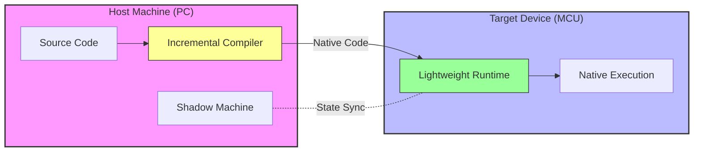

# Introduction

Welcome to **BlueScript**.

BlueScript is not just another programming language with a new syntax. It is a next-generation language system for microcontrollers, built upon a novel architectural concept called the **Disaggregated Virtual Machine**.

## Why BlueScript? 
**The Existing Trade-off:**
Until now, microcontroller development has forced developers to choose between two extremes:

1.  **C/C++ (Compiled Languages):**
    *   **Pros:** High execution speed, high memory efficiency.
    *   **Cons:** Slow development cycle (compile → flash → run), requires physical cable connection.
2.  **MicroPython / Espruino (Interpreted Languages):**
    *   **Pros:** Easy to write, rapid prototyping.
    *   **Cons:** Slow execution speed, high memory consumption (RAM) because compilation and interpretation happen on the device.

BlueScript resolves this dilemma. By adopting the **Disaggregated VM** architecture, it delivers the **flexibility of a script language** with **performance comparable to compiled languages**.

## What is a Disaggregated VM?

Traditional Virtual Machines (Monolithic VMs) cram the compiler, interpreter, and runtime all into the microcontroller's limited memory.

BlueScript physically separates (disaggregates) these VM components between the **Host (PC)** and the **Target (Microcontroller)**.

### Architecture Overview

### Core Technologies

This architecture is powered by three key technologies:

1.  **Offloaded Compilation**
    Resource-heavy compilation tasks are offloaded to the powerful Host PC. The incremental compiler on the host converts BlueScript code into optimized native code. The microcontroller only receives and executes this code, resulting in **significantly faster execution and lower memory usage** compared to MicroPython.

2.  **Shadow Machine**
    The Host PC maintains a "Shadow Machine" that mirrors the state of the microcontroller (memory map, symbol tables, etc.). Because the host knows the exact state of the device, it can compile new code fragments that link correctly to the running program. This enables **interactive development**.

3.  **Bluetooth OTA Updates**
    Since the compiled binary differences are very small, they can be transferred instantly over Bluetooth Low Energy (BLE). Once the runtime is flashed, you can update your program **wirelessly without cables**.

## The BlueScript Experience

Thanks to this unique architecture, BlueScript offers a developer experience unlike any other:

*   **TypeScript-like Syntax:** Write in a modern, familiar syntax.
*   **Inline C:** Embed C code directly for critical performance sections or hardware access.
*   **Interactive Mode (`bscript repl`):** Execute code line-by-line and inspect variables instantly, just like a REPL, but with compiled performance.

:::info Academic Background
The architecture of BlueScript is based on the research paper *["BlueScript: A Disaggregated Virtual Machine for Microcontrollers"](https://arxiv.org/pdf/2511.15821v1)*.
:::

## Supported Hardware

Currently, BlueScript supports the following platform:
- Espressif ESP32 (Supported)

:::note Future Roadmap
We plan to support other boards in the future.
:::